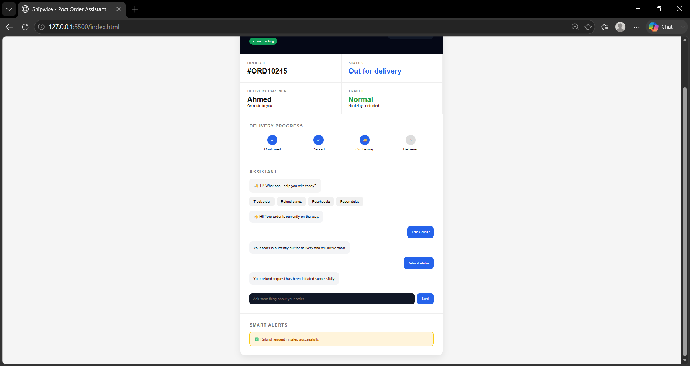

# E-commerce Post-Order AI Assistant

## 🚀 Live Demo

https://niharika-kk.github.io/ecommerce-postorder-ai-assistant/

---

## 📌 Project Overview

The E-commerce Post-Order AI Assistant is a modern AI-powered customer support prototype designed to improve the post-purchase experience for marketplace and e-commerce platforms.

The system helps customers:
- Track delivery status
- Monitor live ETA updates
- Receive smart delivery alerts
- Interact with an AI-powered support assistant
- Manage delivery-related concerns in real time

This project simulates how modern marketplace platforms like Amazon, Talabat, Noon, Careem, and Uber Eats improve customer transparency and operational efficiency after an order is placed.

---

## 🎯 Problem Statement

Customers often experience frustration after placing an order due to:

- Lack of delivery transparency
- Delayed customer support responses
- Unclear ETA updates
- Poor refund visibility
- Delivery uncertainty during traffic or peak hours

This project addresses those challenges through an interactive AI-driven post-order support experience.

---

## ✨ Key Features

### ✅ Live ETA Countdown
- Dynamic delivery countdown system
- Real-time ETA reduction simulation

### ✅ AI-Powered Chat Assistant
- Conversational support workflow
- Dynamic AI response handling
- Interactive customer support experience

### ✅ Smart Delivery Alerts
- Traffic-based delivery notifications
- Dynamic operational alerts
- Customer communication simulation

### ✅ Delivery Progress Tracking
- Real-time order stage visualization
- Delivery lifecycle representation

### ✅ Interactive Conversation UI
- User message bubbles
- AI response bubbles
- Modern chatbot experience

### ✅ Modern Marketplace Dashboard UI
- Premium SaaS-inspired layout
- Marketplace operations design style
- Responsive interface structure

---

## 🛠️ Tech Stack

| Technology | Purpose |
|---|---|
| HTML | Structure |
| CSS | Styling & Layout |
| JavaScript | Dynamic Interactions |

---

## 🧠 Product Thinking Behind the Project

This project was designed not only as a frontend application but also as a product-thinking exercise focused on:

- Customer journey optimization
- Marketplace operations workflow
- AI-assisted support systems
- Delivery transparency
- Operational communication

The goal was to simulate a realistic post-order support workflow commonly used in modern e-commerce ecosystems.

---

## 📷 Screenshots

### 🏠 Homepage

### 🤖 AI Assistant Chat

---

## 🔮 Future Improvements

- Google Maps integration
- Real-time rider tracking
- Backend order database
- AI sentiment detection
- Voice assistant support
- Customer authentication system
- Multi-order management

---

## 📈 Industry Relevance

This project aligns with workflows used in:
- E-commerce Platforms
- Marketplace Operations
- Delivery Management Systems
- AI Customer Support Products
- Product Operations Teams

---

## ⭐ Repository Highlights

- Live deployed website
- Interactive AI workflow simulation
- Real-world marketplace use case
- Product-oriented portfolio project
- Modern UI/UX implementation

---
